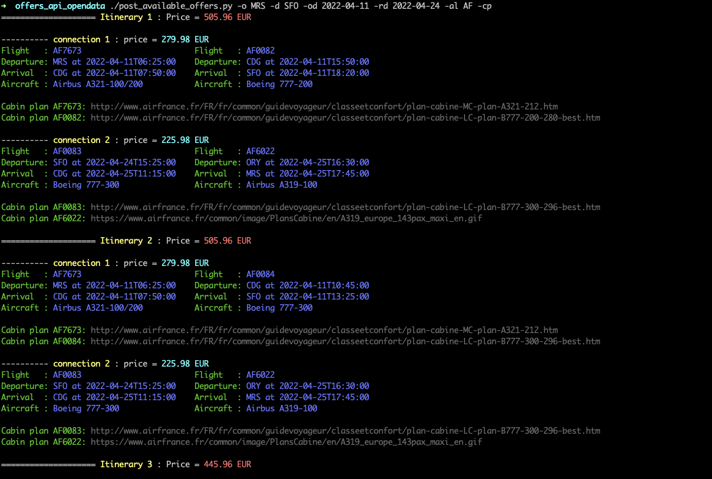
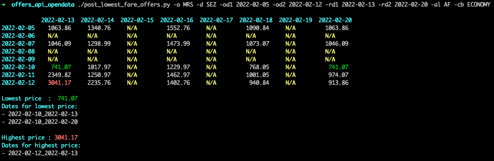

# Python scripts to get flight offer from AirFrance-KLM

## post_available_offers.py

List all possible flight from an origin airport to destination airport on given outbound date and return date

## post_lowest_fare_offers.py

List cheapest_flight rom an origin airport to destination airport on a range of outbound dates and return dates

## PREREQUISITE:

- register for free at https://docs.airfranceklm.com/docs/read/opendata/offers to get your API key
- modify the script to put your own API key

## EXAMPLES:

